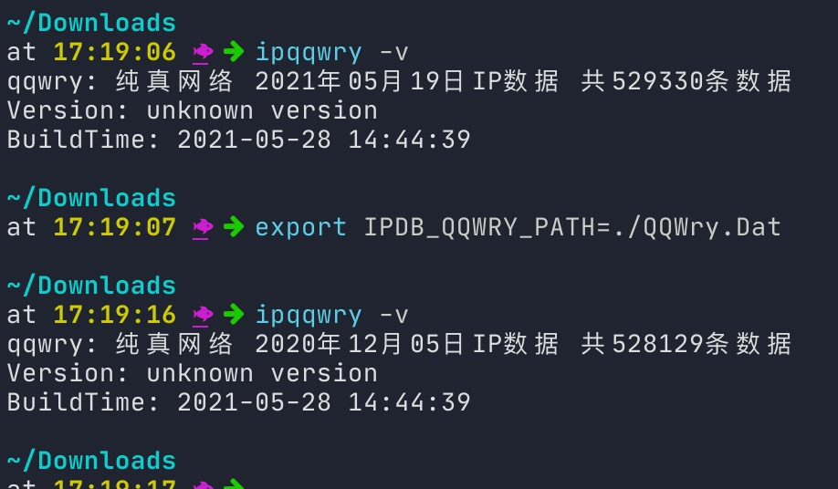

<h1 align="center">
  <br>ipqqwry<br>
</h1>

<h4 align="center">一个(包含)纯真IP库的单一可执行文件</h4>


## 来源

该工具出自自身需求，写完后，发现已经存在一个同类型的工具 [Nali](https://github.com/zu1k/nali), 本着"重新造轮子"的精神，发布了出来。

与 Nali 最大的不同，估计就是只支持纯真IP库，并且为了部署，分发便利，将纯正库直接编译进了可执行文件内，下载相应版本的可执行文件，就可以直接运行使用。

同时，整日面对黑漆漆的终端框，我喜欢丰富的颜色，所以还给工具增加了IPv4、IPv6、MAC 地址颜色高亮的功能。

## 功能

- 单一可执行文件（纯真库已经编译进可执行文件内，也可通过环境变量`IPDB_QQWRY_PATH`指定使用外部纯正库）
- 纯真 IPv4 离线数据库
- 支持域名、URL 、IPv4 的直接查询
- 支持管道处理（管道模式下，支持IPv4、IPv6、MAC 地址字符的颜色高亮） 
- 查询完全离线
- 全平台支持（go语言的功劳）


## 安装

### 从源码安装

ipqqwry 需要预先安装 Go. 安装后可以从源码安装软件:

```sh
$ go get -u -v github.com/leolovenet/ipqqwry
```

### 下载预编译的可执行程序

可以从Release页面下载预编译好的可执行程序: [Release](https://github.com/leolovenet/ipqqwry/releases)

你需要选择适合你系统和硬件架构的版本下载，解压后可直接运行

## 使用说明

### 直接查询 IP、域名、URL 中 HostName 的归属地信息

```
$ ipqqwry 1.1.1.1 2.2.2.2 weibo.com https://google.com/ncr
[
  {
    "ip     ": "1.1.1.1",
    "country": "美国",
    "area   ": "APNIC\u0026CloudFlare公共DNS服务器"
  },
  {
    "ip     ": "2.2.2.2",
    "country": "法国",
    "area   ": "Orange"
  },
  {
    "domain ": "weibo.com",
    "ip     ": "123.125.23.27",
    "country": "北京市",
    "area   ": "亦庄联通数据中心"
  },
  {
    "domain ": "weibo.com",
    "ip     ": "123.125.22.241",
    "country": "北京市",
    "area   ": "亦庄联通数据中心"
  },
  {
    "domain ": "weibo.com",
    "ip     ": "123.125.106.66",
    "country": "北京市",
    "area   ": "新浪互联信息服务联通节点"
  },
  {
    "domain ": "weibo.com",
    "ip     ": "123.125.106.67",
    "country": "北京市",
    "area   ": "新浪互联信息服务联通节点"
  },
  {
    "domain ": "google.com",
    "ip     ": "59.24.3.174",
    "country": "韩国",
    "area   ": "KT电信"
  }
]
```

### 或者 使用 `管道模式`

该模式的工作原理，就是对标准输入进行"逐行扫描"，然后对发现的IPv4进行归属地查询，并将查询结果附加到IP的后面，再输出到标准输出。如果发现标准输出为终端，则附加上颜色信息（可强制关闭）。

```
$ echo IP 6.6.6.6 | ipqqwry
IP 6.6.6.6(美国,亚利桑那州华楚卡堡市美国国防部网络中心)

#或者
$ ifconfig | ipqqwry

#或者
$ ip addr show  | ipqqwry

#或者 (注意添加 -l 选项)
$ tcpdump -lnni any icmp | ipqqwry

```


### 更换数据库


```shell
export IPDB_QQWRY_PATH=/some/other/qqwry.dat
    
ipqqwry -v
```



## 查看帮助

直接运行 ipqqwry 命令

```shell
$ ipqqwry
Usage: 
  ipqqwry [ip | domain] ...
  ifconfig | ipqqwry [-p | -C]    Using pipeline, translate the included ip address information.
                                  The -p option also translates(default not) non-public IP information.
                                  The -C option suppress color output.
  ipqqwry [-v | version]          show qqwry version.
```


## 测试效果
```shell
cat test.log | ipqqwry
```

## 感谢列表
- [纯真QQIP离线数据库](http://www.cz88.net/fox/ipdat.shtml)
- [qqwry mirror](https://qqwry.mirror.noc.one/)
- [qqwry纯真数据库解析](https://metacpan.org/pod/IP::QQWry)
- [nali](https://github.com/zu1k/nali)
